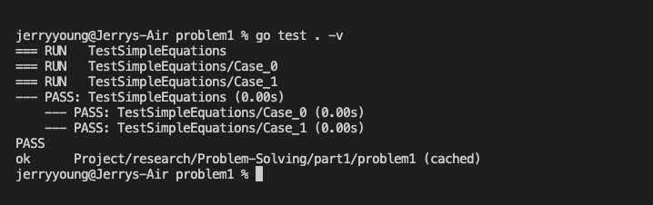

## Cara mengerjakan tugas

clone project ini, melalui

```
git clone https://github.com/ALTA-Immersive-BE5/Problem-Solving-Paradigm.git
```

setelah clone selesai, `pindah ke folder hasil clone`

buat repository pada github organization kalian dengan format: 

`Problem-Solving-Paradigm`

Tambahkan remote menuju repository yang telah kalian buat. 

`JANGAN MENGGUNAKAN NAMA ORIGIN`

```
git remote add nama-remote url-repository-kalian
```

`LAKUKAN PUSH KE REMOTE YANG BARU!` ~ Done


## Tatacara Pengerjaan Tugas

1. Lengkapi function yang sudah disediakan
2. DILARANG MENGUBAH TIPE DATA HASIL RETURN
3. Untuk melakukan run program setiap soal lakukan seperti contoh(sesuaikan keperluan): 
    ```
    go run ./problem1/problem1.go
    ```
4. Setelah semua program selesai dikerjakan, jalankan proses testing (sesuaikan keperluan)
    ```
    go test . -v
    ```
5. Screenshoot terminal hasil perintah nomer 4

6. Push project ini dan hasil screenshoot ke repo yang telah dibuat pada github organization.
7. Selamat Mencoba!!!